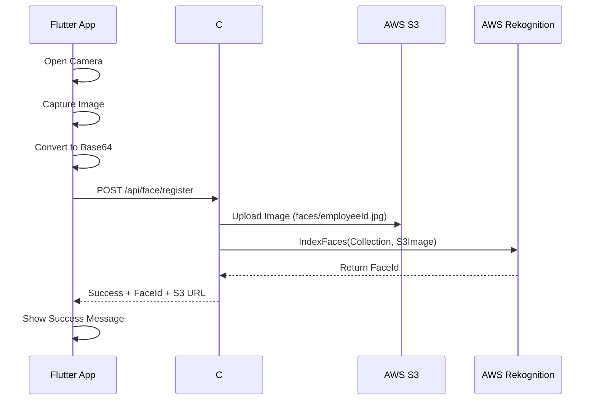
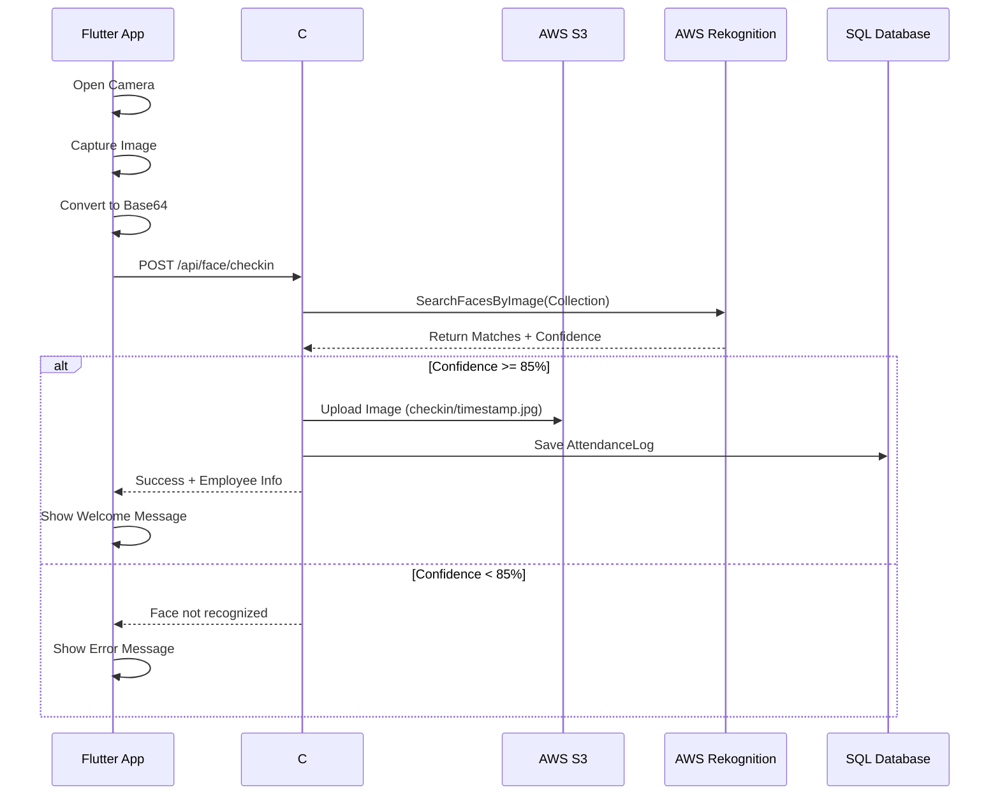

# TECHNICAL DOCUMENTATION - HỆ THỐNG QUẢN LÝ NHÂN VIÊN & FACE ID

## 📋 MỤC LỤC

1. [Architecture Overview](#architecture-overview)
2. [Database Design](#database-design)
3. [API Documentation](#api-documentation)
4. [Face Recognition Flow](#face-recognition-flow)
5. [Frontend Implementation](#frontend-implementation)
6. [Security & Authentication](#security--authentication)
7. [Deployment Guide](#deployment-guide)
8. [Testing Strategy](#testing-strategy)

---

## 🏗️ ARCHITECTURE OVERVIEW

### System Architecture
```
┌─────────────────┐    ┌─────────────────┐    ┌─────────────────┐
│   Flutter App   │    │   C# .NET API   │    │   AWS Services  │
│                 │    │                 │    │                 │
│  ┌───────────┐  │    │  ┌───────────┐  │    │  ┌───────────┐  │
│  │    UI     │  │    │  │Controller │  │    │  │Rekognition│  │
│  │           │  │    │  │           │  │    │  │Collection │  │
│  │ Material3 │  │◄──►│  │ Employee  │  │◄──►│  │           │  │
│  │  Screens  │  │    │  │ Face API  │  │    │  │ Face ID   │  │
│  │           │  │    │  │ Payroll   │  │    │  │   Match   │  │
│  └───────────┘  │    │  └───────────┘  │    │  └───────────┘  │
│                 │    │                 │    │                 │
│  ┌───────────┐  │    │  ┌───────────┐  │    │  ┌───────────┐  │
│  │  Models   │  │    │  │ Services  │  │    │  │    S3     │  │
│  │           │  │    │  │           │  │    │  │  Storage  │  │
│  │ Employee  │  │    │  │ Database  │  │    │  │   faces/  │  │
│  │   Face    │  │    │  │  Context  │  │    │  │ checkin/  │  │
│  │ Payroll   │  │    │  │           │  │    │  │checkout/  │  │
│  └───────────┘  │    │  └───────────┘  │    │  └───────────┘  │
│                 │    │                 │    │                 │
│  ┌───────────┐  │    │  ┌───────────┐  │    │                 │
│  │ Services  │  │    │  │   SQL     │  │    │                 │
│  │           │  │    │  │ Server    │  │    │                 │
│  │   HTTP    │  │    │  │ Database  │  │    │                 │
│  │  Client   │  │    │  │           │  │    │                 │
│  │   Dio     │  │    │  │           │  │    │                 │
│  └───────────┘  │    │  └───────────┘  │    │                 │
└─────────────────┘    └─────────────────┘    └─────────────────┘
```

### Technology Stack

#### Frontend (Flutter)
- **Framework**: Flutter 3.x
- **Language**: Dart 3.x
- **Architecture**: MVVM Pattern
- **State Management**: Provider + Riverpod
- **HTTP Client**: Dio 5.x
- **UI Framework**: Material Design 3

#### Backend (C# .NET)
- **Framework**: ASP.NET Core 6.0+
- **Database**: SQL Server
- **ORM**: Entity Framework Core
- **Authentication**: JWT (planned)
- **Documentation**: Swagger/OpenAPI

#### Cloud Services (AWS)
- **Face Recognition**: AWS Rekognition
- **Image Storage**: AWS S3
- **Collection ID**: `face-collection-hoang`
- **Bucket Structure**: 
  - `faces/` - Face registration images
  - `checkin/` - Check-in images  
  - `checkout/` - Check-out images

---

## 🗄️ DATABASE DESIGN

### Core Tables

#### Employees
```sql
CREATE TABLE Employees (
    Id INT PRIMARY KEY IDENTITY(1,1),
    EmployeeCode NVARCHAR(50) UNIQUE NOT NULL,
    FullName NVARCHAR(255) NOT NULL,
    Email NVARCHAR(255),
    Phone NVARCHAR(20),
    DateOfBirth DATE,
    Address NVARCHAR(500),
    DepartmentId INT,
    Position NVARCHAR(100),
    HireDate DATE NOT NULL,
    IsActive BIT DEFAULT 1,
    CreatedAt DATETIME2 DEFAULT GETDATE(),
    UpdatedAt DATETIME2 DEFAULT GETDATE(),
    
    FOREIGN KEY (DepartmentId) REFERENCES Departments(Id)
);
```

#### Departments
```sql
CREATE TABLE Departments (
    Id INT PRIMARY KEY IDENTITY(1,1),
    Code NVARCHAR(50) UNIQUE,
    Name NVARCHAR(255) NOT NULL,
    Description NVARCHAR(500),
    ManagerId INT,
    CreatedAt DATETIME2 DEFAULT GETDATE(),
    
    FOREIGN KEY (ManagerId) REFERENCES Employees(Id)
);
```

#### FaceRegistrations
```sql
CREATE TABLE FaceRegistrations (
    Id INT PRIMARY KEY IDENTITY(1,1),
    EmployeeId INT UNIQUE NOT NULL,
    FaceId NVARCHAR(255) NOT NULL, -- AWS Rekognition Face ID
    S3ImageUrl NVARCHAR(500),
    ConfidenceScore DECIMAL(5,2),
    IsActive BIT DEFAULT 1,
    CreatedAt DATETIME2 DEFAULT GETDATE(),
    UpdatedAt DATETIME2 DEFAULT GETDATE(),
    
    FOREIGN KEY (EmployeeId) REFERENCES Employees(Id)
);
```

#### AttendanceLogs
```sql
CREATE TABLE AttendanceLogs (
    Id INT PRIMARY KEY IDENTITY(1,1),
    EmployeeId INT NOT NULL,
    CheckTime DATETIME2 NOT NULL,
    CheckType NVARCHAR(10) NOT NULL, -- 'IN' or 'OUT'
    S3ImageUrl NVARCHAR(500),
    ConfidenceScore DECIMAL(5,2),
    Location NVARCHAR(255),
    DeviceInfo NVARCHAR(255),
    CreatedAt DATETIME2 DEFAULT GETDATE(),
    
    FOREIGN KEY (EmployeeId) REFERENCES Employees(Id)
);
```

#### PayrollPeriods
```sql
CREATE TABLE PayrollPeriods (
    Id INT PRIMARY KEY IDENTITY(1,1),
    Name NVARCHAR(255) NOT NULL,
    StartDate DATE NOT NULL,
    EndDate DATE NOT NULL,
    Status NVARCHAR(50) DEFAULT 'Active', -- Active, Processed, Closed
    CreatedAt DATETIME2 DEFAULT GETDATE()
);
```

#### PayrollRules
```sql
CREATE TABLE PayrollRules (
    Id INT PRIMARY KEY IDENTITY(1,1),
    EmployeeId INT NOT NULL,
    BaseSalary DECIMAL(18,2) NOT NULL,
    OvertimeRate DECIMAL(5,2) DEFAULT 1.5,
    SocialInsuranceRate DECIMAL(5,2) DEFAULT 0.08,
    HealthInsuranceRate DECIMAL(5,2) DEFAULT 0.015,
    UnemploymentInsuranceRate DECIMAL(5,2) DEFAULT 0.01,
    PersonalIncomeTaxRate DECIMAL(5,2) DEFAULT 0.10,
    IsActive BIT DEFAULT 1,
    CreatedAt DATETIME2 DEFAULT GETDATE(),
    
    FOREIGN KEY (EmployeeId) REFERENCES Employees(Id)
);
```

### Entity Relationships
```
Departments (1) ──── (N) Employees
Employees (1) ──── (1) FaceRegistrations  
Employees (1) ──── (N) AttendanceLogs
Employees (1) ──── (N) PayrollRules
PayrollPeriods (1) ──── (N) PayrollRecords
```

---

## 🔌 API DOCUMENTATION

### Base Configuration
```
Base URL: https://api.studyplannerapp.io.vn/api
Content-Type: application/json
Authentication: Bearer Token (planned)
```

### Employee Controller

#### 1. Get All Employees
```http
GET /api/employee
```
**Response:**
```json
{
  "success": true,
  "data": [
    {
      "id": 1,
      "employeeCode": "EMP001",
      "fullName": "Nguyễn Văn A",
      "email": "nguyenvana@company.com",
      "phone": "0123456789",
      "department": {
        "id": 1,
        "name": "IT Department"
      },
      "isActive": true,
      "hasFaceId": true
    }
  ]
}
```

#### 2. Create Employee
```http
POST /api/employee
```
**Request:**
```json
{
  "employeeCode": "EMP002",
  "fullName": "Trần Thị B",
  "email": "tranthib@company.com",
  "phone": "0987654321",
  "dateOfBirth": "1990-01-15",
  "address": "123 Main St, Hanoi",
  "departmentId": 1,
  "position": "Developer",
  "hireDate": "2025-01-01"
}
```

#### 3. Get Departments
```http
GET /api/employee/departments
```
**Response:**
```json
{
  "success": true,
  "data": [
    {
      "id": 1,
      "code": "IT",
      "name": "IT Department",
      "description": "Information Technology",
      "employeeCount": 15
    }
  ]
}
```

### Face API Controller

#### 1. Register Face
```http
POST /api/face/register
```
**Request:**
```json
{
  "employeeId": 1,
  "imageBase64": "iVBORw0KGgoAAAANSUhEUgAA..." // Base64 image data
}
```
**Response:**
```json
{
  "success": true,
  "message": "Face registered successfully",
  "data": {
    "faceId": "12345-67890-abcdef",
    "s3ImageUrl": "https://bucket.s3.amazonaws.com/faces/1.jpg"
  }
}
```

#### 2. Check-in with Face
```http
POST /api/face/checkin
```
**Request:**
```json
{
  "imageBase64": "iVBORw0KGgoAAAANSUhEUgAA..." // Base64 image data
}
```
**Response:**
```json
{
  "success": true,
  "status": "success",
  "message": "Check-in successful",
  "confidence": 92.5,
  "data": {
    "matchedEmployee": {
      "employeeId": 1,
      "employeeCode": "EMP001",
      "fullName": "Nguyễn Văn A",
      "department": "IT Department"
    },
    "attendanceInfo": {
      "checkTime": "2025-10-18T08:30:00Z",
      "checkType": "IN",
      "s3ImageUrl": "https://bucket.s3.amazonaws.com/checkin/1729242600.jpg"
    }
  }
}
```

### Payroll Controller

#### 1. Create Payroll Period
```http
POST /api/payroll/periods
```
**Request:**
```json
{
  "name": "October 2025",
  "startDate": "2025-10-01",
  "endDate": "2025-10-31"
}
```

#### 2. Generate Payroll
```http
POST /api/payroll/generate/{periodId}
```
**Response:**
```json
{
  "success": true,
  "message": "Payroll generated successfully",
  "data": {
    "periodId": 1,
    "totalEmployees": 25,
    "totalGrossSalary": 1500000000,
    "totalNetSalary": 1200000000,
    "totalTax": 150000000,
    "totalInsurance": 150000000
  }
}
```

---

## 📷 FACE RECOGNITION FLOW

### Registration Flow


### Check-in/Check-out Flow


### AWS Rekognition Configuration
```csharp
// C# Backend Configuration
public class FaceRecognitionService
{
    private const string COLLECTION_ID = "face-collection-hoang";
    private const float CONFIDENCE_THRESHOLD = 85.0f;
    
    public async Task<string> RegisterFaceAsync(byte[] imageBytes, string employeeId)
    {
        var request = new IndexFacesRequest
        {
            CollectionId = COLLECTION_ID,
            Image = new Image
            {
                S3Object = new S3Object
                {
                    Bucket = "your-bucket",
                    Name = $"faces/{employeeId}.jpg"
                }
            },
            ExternalImageId = employeeId,
            MaxFaces = 1,
            QualityFilter = QualityFilter.AUTO
        };
        
        var response = await _rekognitionClient.IndexFacesAsync(request);
        return response.FaceRecords.FirstOrDefault()?.Face?.FaceId;
    }
}
```

---

## 📱 FRONTEND IMPLEMENTATION

### Project Structure
```
lib/
├── config/
│   └── app_config.dart              # Configuration constants
├── models/
│   ├── employee.dart                # Employee model
│   ├── department.dart              # Department model
│   └── dto/
│       ├── employee_dtos.dart       # Request/Response DTOs
│       └── payroll_dtos.dart        # Payroll DTOs
├── services/
│   ├── api_service.dart             # Base API service
│   ├── employee_api_service.dart    # Employee endpoints
│   ├── face_api_service.dart        # Face recognition endpoints
│   └── payroll_api_service.dart     # Payroll endpoints
├── screens/
│   ├── home_screen.dart             # Dashboard
│   ├── employee/
│   │   ├── employee_list_screen.dart
│   │   ├── employee_create_screen.dart
│   │   ├── employee_detail_screen.dart
│   │   └── employee_form_screen.dart
│   ├── face/
│   │   ├── face_register_screen.dart
│   │   └── face_checkin_screen.dart
│   └── payroll/
│       └── payroll_dashboard_screen.dart
├── utils/
│   ├── camera_helper.dart           # Camera utilities
│   ├── app_logger.dart             # Logging system
│   └── http_client.dart            # HTTP client wrapper
└── main.dart                       # App entry point
```

### Key Implementation Details

#### 1. HTTP Client Configuration
```dart
// utils/http_client.dart
class CustomHttpClient {
  static final Dio _dio = Dio(BaseOptions(
    baseUrl: AppConfig.baseUrl,
    connectTimeout: const Duration(seconds: 30),
    receiveTimeout: const Duration(seconds: 30),
    headers: {
      'Content-Type': 'application/json',
      'Accept': 'application/json',
    },
  ));

  static Future<Response> post(Uri url, {
    Map<String, String>? headers,
    String? body,
  }) async {
    try {
      final response = await _dio.post(
        url.path,
        data: body,
        options: Options(headers: headers),
      );
      return response;
    } catch (e) {
      throw _handleError(e);
    }
  }
}
```

#### 2. Camera Helper
```dart
// utils/camera_helper.dart
class CameraHelper {
  static CameraController? _controller;
  static List<CameraDescription>? _cameras;

  static Future<void> initializeCamera() async {
    _cameras = await availableCameras();
    _controller = CameraController(
      _cameras!.first,
      ResolutionPreset.high,
      enableAudio: false,
    );
    await _controller!.initialize();
  }

  static Future<String> captureAndConvertToBase64() async {
    final XFile image = await _controller!.takePicture();
    final bytes = await image.readAsBytes();
    
    // Resize image to max 800x800 for better performance
    final resized = await _resizeImage(bytes);
    return base64Encode(resized);
  }

  static Future<Uint8List> _resizeImage(Uint8List bytes) async {
    final image = img.decodeImage(bytes)!;
    final resized = img.copyResize(image, width: 800, height: 800);
    return Uint8List.fromList(img.encodeJpg(resized, quality: 85));
  }
}
```

#### 3. API Service Pattern
```dart
// services/base_api_service.dart
abstract class BaseApiService {
  Future<ApiResponse<T>> handleRequest<T>(
    Future<Response> Function() request,
    T Function(Map<String, dynamic>) fromJson,
  ) async {
    try {
      final response = await request();
      
      if (response.statusCode == 200) {
        if (response.data is Map<String, dynamic>) {
          return ApiResponse.success(fromJson(response.data));
        }
      }
      
      return ApiResponse.error('Invalid response format');
    } catch (e) {
      AppLogger.error('API Error: $e');
      return ApiResponse.error(_getErrorMessage(e));
    }
  }
}
```

#### 4. Logging System
```dart
// utils/app_logger.dart
class AppLogger {
  static void apiRequest(String endpoint, {
    required String method,
    Map<String, dynamic>? data,
  }) {
    final maskedData = _maskSensitiveData(data);
    print('🚀 [API REQUEST] $method $endpoint');
    if (maskedData != null) {
      print('    Data: $maskedData');
    }
  }

  static Map<String, dynamic>? _maskSensitiveData(Map<String, dynamic>? data) {
    if (data == null) return null;
    
    final masked = Map<String, dynamic>.from(data);
    if (masked.containsKey('imageBase64')) {
      final size = (masked['imageBase64'] as String).length;
      masked['imageBase64'] = '[MASKED - ${(size / 1024).toStringAsFixed(1)} KB]';
    }
    return masked;
  }
}
```

---

## 🔐 SECURITY & AUTHENTICATION

### Current Security Measures

#### 1. HTTPS Communication
```dart
// All API calls use HTTPS
static const String baseUrl = 'https://api.studyplannerapp.io.vn/api';
```

#### 2. Data Validation
```dart
// Input validation for face registration
class RegisterEmployeeFaceRequest {
  Map<String, dynamic> toJson() {
    if (imageBase64.isEmpty) {
      throw ArgumentError('imageBase64 cannot be empty');
    }
    if (imageBase64.length < 100) {
      throw ArgumentError('imageBase64 too short');
    }
    return {
      'employeeId': employeeId,
      'imageBase64': imageBase64,
    };
  }
}
```

#### 3. Sensitive Data Masking
```dart
// Logging system masks sensitive data
static Map<String, dynamic>? _maskSensitiveData(Map<String, dynamic>? data) {
  // Masks imageBase64 and other sensitive fields
}
```

### Planned Security Enhancements

#### 1. JWT Authentication
```dart
// Future implementation
class AuthService {
  static String? _accessToken;
  static String? _refreshToken;

  static Map<String, String> get authHeaders => {
    'Authorization': 'Bearer $_accessToken',
    'Content-Type': 'application/json',
  };
}
```

#### 2. Role-Based Access Control
```dart
enum UserRole { Admin, Manager, Employee }

class User {
  final String id;
  final String name;
  final UserRole role;
  final List<Permission> permissions;
}
```

---

## 🚀 DEPLOYMENT GUIDE

### Prerequisites
- Flutter SDK 3.0+
- Android Studio / VS Code
- Physical device with camera
- Network connectivity

### Environment Setup

#### 1. Development Environment
```bash
# Clone repository
git clone [repository-url]
cd employee_management_test

# Install dependencies
flutter pub get

# Run on device
flutter run --debug
```

#### 2. Production Build
```bash
# Android APK
flutter build apk --release --target-platform android-arm64

# Android App Bundle (recommended for Play Store)
flutter build appbundle --release

# iOS (requires Mac)
flutter build ios --release
```

#### 3. Configuration Files

**android/app/src/main/AndroidManifest.xml**
```xml
<uses-permission android:name="android.permission.CAMERA" />
<uses-permission android:name="android.permission.INTERNET" />
<uses-permission android:name="android.permission.WRITE_EXTERNAL_STORAGE" />
```

**ios/Runner/Info.plist**
```xml
<key>NSCameraUsageDescription</key>
<string>This app needs camera access for face recognition</string>
<key>NSPhotoLibraryUsageDescription</key>
<string>This app needs photo library access to select images</string>
```

### API Server Deployment

#### 1. C# .NET API Server
```bash
# Publish API
dotnet publish -c Release -o ./publish

# Run on server
dotnet YourApi.dll --urls="http://*:5000"
```

#### 2. AWS Configuration
```json
{
  "AWS": {
    "Region": "ap-southeast-1",
    "AccessKey": "YOUR_ACCESS_KEY",
    "SecretKey": "YOUR_SECRET_KEY",
    "S3Bucket": "your-face-recognition-bucket",
    "RekognitionCollection": "face-collection-hoang"
  }
}
```

---

## 🧪 TESTING STRATEGY

### Manual Testing Checklist

#### Employee Management
- [ ] Create new employee with all fields
- [ ] View employee list with filtering
- [ ] Update employee information
- [ ] Department selection works
- [ ] Form validation works correctly

#### Face Recognition
- [ ] Face registration with camera
- [ ] Face registration with gallery image
- [ ] Check-in with registered face
- [ ] Check-out with registered face
- [ ] Unregistered face rejection
- [ ] Low confidence rejection (<85%)

#### Payroll System
- [ ] Create payroll period
- [ ] Generate payroll for all employees
- [ ] View payroll summary
- [ ] Individual payroll records
- [ ] Tax calculations accuracy

#### API Integration
- [ ] All 18 endpoints working
- [ ] Error handling for network issues
- [ ] Response parsing correctness
- [ ] Loading states display
- [ ] Success/error messages

### Automated Testing (Future)

#### Unit Tests
```dart
// Example test for face service
void main() {
  group('FaceApiService', () {
    test('should register face successfully', () async {
      final service = FaceApiService();
      final request = RegisterEmployeeFaceRequest(
        employeeId: 1,
        imageBase64: 'valid_base64_string',
      );
      
      final response = await service.register(request);
      
      expect(response.success, true);
      expect(response.data?.faceId, isNotNull);
    });
  });
}
```

#### Integration Tests
```dart
// Example integration test
void main() {
  group('Employee Management Flow', () {
    testWidgets('should create employee and register face', (tester) async {
      await tester.pumpWidget(MyApp());
      
      // Navigate to create employee
      await tester.tap(find.text('Add Employee'));
      await tester.pumpAndSettle();
      
      // Fill form
      await tester.enterText(find.byKey(Key('fullName')), 'Test User');
      await tester.enterText(find.byKey(Key('email')), 'test@example.com');
      
      // Submit form
      await tester.tap(find.text('Save'));
      await tester.pumpAndSettle();
      
      // Verify employee created
      expect(find.text('Test User'), findsOneWidget);
    });
  });
}
```

### Performance Testing

#### Metrics to Monitor
- **App startup time**: < 3 seconds
- **Camera initialization**: < 2 seconds
- **Image capture & upload**: < 5 seconds
- **Face recognition response**: < 3 seconds
- **API response time**: < 2 seconds
- **Memory usage**: < 200MB
- **Battery consumption**: Minimal impact

---

## 📋 TROUBLESHOOTING GUIDE

### Common Issues

#### 1. Camera Permission Denied
```
Error: Camera permission denied
Solution: Check AndroidManifest.xml and iOS Info.plist permissions
```

#### 2. API Connection Failed
```
Error: Network error / Connection timeout
Solution: 
- Check internet connectivity
- Verify API endpoint URL
- Check server status
```

#### 3. Face Registration Failed
```
Error: Face not detected / AWS error
Solution:
- Ensure good lighting
- Face should be clearly visible
- Check AWS credentials
- Verify collection exists
```

#### 4. Build Errors
```
Error: Dependency conflicts / Build failed
Solution:
flutter clean
flutter pub get
flutter build apk
```

### Debug Commands
```bash
# Check Flutter doctor
flutter doctor -v

# Clean build
flutter clean && flutter pub get

# Run with verbose logging
flutter run --verbose

# Check device logs
flutter logs
```

---

## 📞 SUPPORT & MAINTENANCE

### Documentation Updates
- Keep API documentation current
- Update troubleshooting guides
- Maintain deployment procedures
- Document new features

### Monitoring & Logs
- Monitor API response times
- Track error rates
- Review user feedback
- Performance metrics

### Regular Maintenance
- Update dependencies monthly
- Security patches immediately
- Performance optimization quarterly
- Feature enhancement bi-annually

---

**Last Updated**: October 18, 2025  
**Version**: 1.0.0  
**Status**: Production Ready