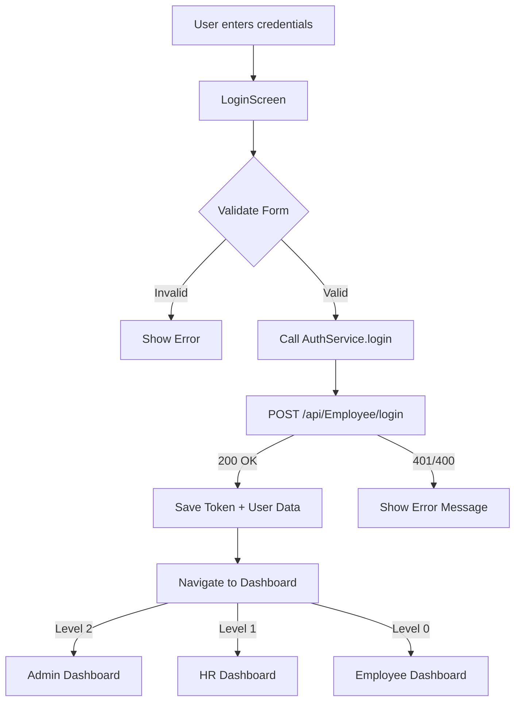
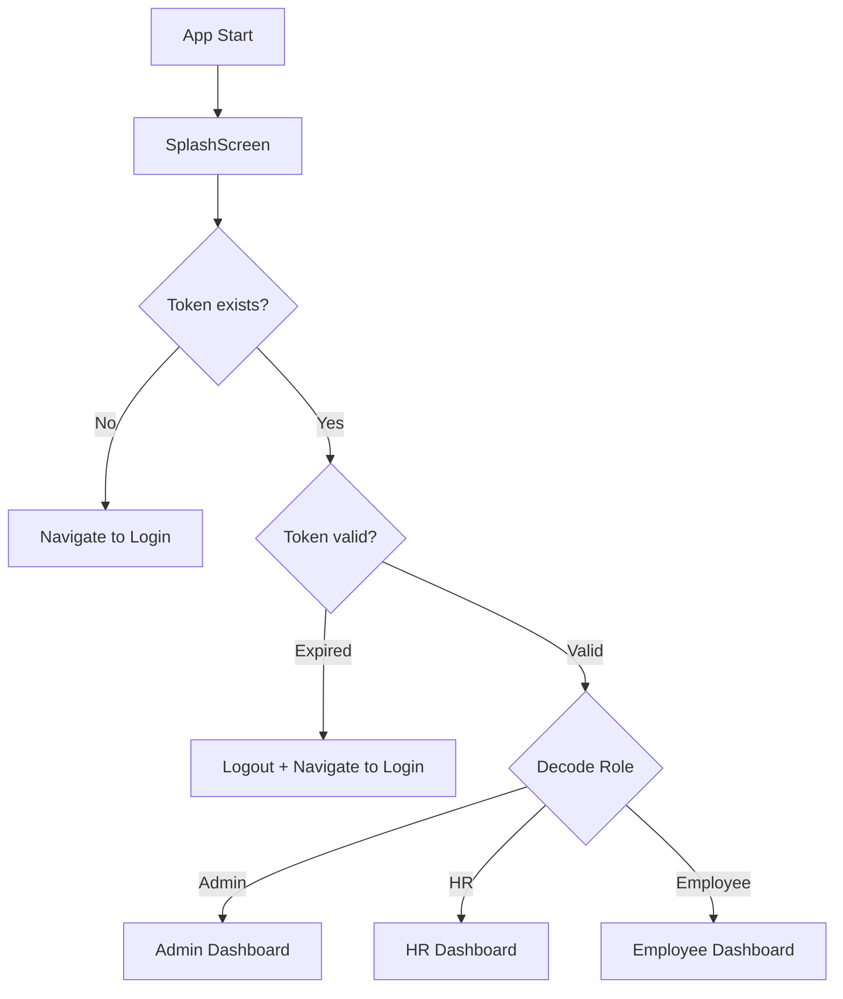

# 🔐 Login System with JWT Authentication

## 📋 Overview

Hệ thống đăng nhập hoàn chỉnh với JWT Authentication, hỗ trợ:
- ✅ Login bằng **Email** hoặc **Mã NV** (Employee Code)
- ✅ Secure Token Storage (Platform-specific: KeyStore/Keychain)
- ✅ Token Validation & Auto-logout khi hết hạn
- ✅ Role-based Navigation (Admin/HR/Employee)
- ✅ Session Management & Splash Screen

---

## 🏗️ Architecture

### 1. Service Layer

#### SecureStorageService (`lib/services/secure_storage_service.dart`)
Quản lý lưu trữ bảo mật cho JWT tokens và user data:

**Platform-specific Storage:**
- **Android**: EncryptedSharedPreferences + KeyStore
- **iOS**: Keychain
- **Windows**: Credential Manager

**Key Methods:**
```dart
// Token Management
await SecureStorageService.saveToken(token);
String? token = await SecureStorageService.readToken();
await SecureStorageService.deleteToken();

// User Session Data
await SecureStorageService.saveUserData(
  employeeId: 123,
  employeeName: 'Nguyễn Văn A',
  email: 'a@company.com',
  role: 'Admin',
  roleLevel: 2,
);
Map<String, dynamic>? userData = await SecureStorageService.readUserData();

// Logout
await SecureStorageService.clearAll();

// Check Login Status
bool isLoggedIn = await SecureStorageService.isLoggedIn();
```

---

#### AuthService (`lib/services/auth_service.dart`)
Xử lý authentication logic và API calls:

**Login API:**
```dart
final authService = AuthService();

try {
  final response = await authService.login(
    identifier: 'admin@company.com', // hoặc 'EMP001'
    password: 'admin123',
  );

  print('Welcome: ${response.fullName}');
  print('Role: ${response.roleName} (Level ${response.roleLevel})');
  print('Dashboard: ${response.dashboardRoute}');
} catch (e) {
  print('Login failed: $e');
}
```

**Session Management:**
```dart
// Check if logged in
bool isLoggedIn = await authService.isLoggedIn();

// Get current user
Map<String, dynamic>? user = await authService.getCurrentUser();

// Logout
await authService.logout();

// Check role
bool isAdmin = await authService.isAdmin();
bool isHR = await authService.isHR();
```

**Token Validation:**
```dart
// Check if token valid (not expired)
bool isValid = await authService.isTokenValid();

// Get expiry date
DateTime? expiry = await authService.getTokenExpiryDate();

// Decode token
Map<String, dynamic>? tokenData = await authService.getTokenData();
```

---

### 2. UI Layer

#### SplashScreen (`lib/screens/auth/splash_screen.dart`)
App initialization screen - kiểm tra session khi khởi động:

**Flow:**
1. Show splash animation (1.5s minimum)
2. Check if user logged in (`isLoggedIn()`)
3. Validate token (not expired)
4. Navigate to:
   - **Login Screen** → if not logged in or token expired
   - **Dashboard** → if logged in with valid token (role-based)

---

#### LoginScreen (`lib/screens/auth/login_screen.dart`)
Màn hình đăng nhập với Material 3 design:

**Features:**
- ✅ Single input field: Email **OR** Employee Code
- ✅ Password with show/hide toggle
- ✅ Form validation
- ✅ Loading state (CircularProgressIndicator)
- ✅ Error handling (SnackBar)
- ✅ Role-based navigation

**Usage:**
```dart
Navigator.push(
  context,
  MaterialPageRoute(builder: (context) => LoginScreen()),
);
```

---

### 3. Configuration

#### ApiConfig (`lib/config/api_config.dart`)
Centralized API configuration:

```dart
class ApiConfig {
  static const String baseUrl = 'http://10.0.2.2:5000/api';
  
  // Endpoints
  static const String login = '/Employee/login';
  static const String logout = '/Employee/logout';
  
  // Settings
  static const Duration timeout = Duration(seconds: 30);
  static const int maxRetries = 3;
}
```

**Environment Setup:**
| Environment | Base URL | Notes |
|-------------|----------|-------|
| Android Emulator | `http://10.0.2.2:5000/api` | Maps to host's localhost |
| iOS Simulator | `http://localhost:5000/api` | Direct localhost |
| Physical Device | `http://192.168.1.x:5000/api` | Your computer's IP |
| Production | `https://api.yourcompany.com/api` | HTTPS required |

---

## 🔄 Authentication Flow

### Login Flow


### Session Check Flow (Splash Screen)


---

## 📱 Usage Examples

### Example 1: Login with Email
```dart
await authService.login(
  identifier: 'admin@company.com',
  password: 'admin123',
);
```

### Example 2: Login with Employee Code
```dart
await authService.login(
  identifier: 'EMP001',
  password: 'password123',
);
```

### Example 3: Check Session on App Start
```dart
@override
void initState() {
  super.initState();
  _checkSession();
}

Future<void> _checkSession() async {
  final isLoggedIn = await authService.isLoggedIn();
  
  if (isLoggedIn) {
    final route = await authService.getDashboardRoute();
    Navigator.pushReplacementNamed(context, route);
  } else {
    Navigator.pushReplacementNamed(context, '/login');
  }
}
```

### Example 4: Logout
```dart
ElevatedButton(
  onPressed: () async {
    await authService.logout();
    Navigator.pushNamedAndRemoveUntil(
      context,
      '/login',
      (route) => false, // Remove all previous routes
    );
  },
  child: Text('Đăng xuất'),
);
```

### Example 5: Protected Route (Role Check)
```dart
class AdminOnlyScreen extends StatefulWidget {
  @override
  State<AdminOnlyScreen> createState() => _AdminOnlyScreenState();
}

class _AdminOnlyScreenState extends State<AdminOnlyScreen> {
  final AuthService _authService = AuthService();

  @override
  void initState() {
    super.initState();
    _checkAdminAccess();
  }

  Future<void> _checkAdminAccess() async {
    final isAdmin = await _authService.isAdmin();
    
    if (!isAdmin) {
      // Not admin - redirect
      Navigator.pushReplacementNamed(context, '/login');
      ScaffoldMessenger.of(context).showSnackBar(
        SnackBar(content: Text('Bạn không có quyền truy cập')),
      );
    }
  }

  @override
  Widget build(BuildContext context) {
    return Scaffold(
      appBar: AppBar(title: Text('Admin Dashboard')),
      body: Center(child: Text('Admin only content')),
    );
  }
}
```

---

## 🔑 Backend API Contract (ACTUAL)

### POST /api/Employee/login

**✅ FLEXIBLE LOGIN**: Backend accepts both **Email** OR **Employee Code** in `identifier` field.

**Request Option 1: Login with Email**
```json
{
  "identifier": "admin@test.com",
  "password": "ADMIN-2025-0001@2025"
}
```

**Request Option 2: Login with Employee Code**
```json
{
  "identifier": "ADMIN-2025-0001",
  "password": "ADMIN-2025-0001@2025"
}
```

**Response (200 OK):**
```json
{
  "success": true,
  "token": "eyJhbGciOiJIUzI1NiIsInR5cCI6IkpXVCJ9...",
  "employee": {
    "id": 1,
    "employeeCode": "ADMIN-2025-0001",
    "fullName": "Test Admin",
    "email": "admin@test.com",
    "roleName": "Admin",
    "roleLevel": 2
  },
  "expiresAt": "2025-01-22T12:00:00Z"
}
```

**JWT Payload (Decoded):**
```json
{
  "nameid": "1",
  "unique_name": "ADMIN-2025-0001",
  "email": "admin@test.com",
  "role": "Admin",
  "RoleLevel": "2",
  "DepartmentCode": "ADMIN",
  "exp": 1737547200
}
```

**Response (400 Bad Request) - Invalid Credentials:**
```json
{
  "success": false,
  "message": "Mã nhân viên/Email hoặc mật khẩu không đúng"
}
```

**Response (400 Bad Request) - Account Not Activated:**
```json
{
  "success": false,
  "message": "Tài khoản chưa được kích hoạt"
}
```

**Response (400 Bad Request) - Account Disabled:**
```json
{
  "success": false,
  "message": "Tài khoản đã bị vô hiệu hóa"
}
```

---

## 🔐 Security Features

### 1. Token Storage
- ✅ **Android**: EncryptedSharedPreferences + KeyStore (AES-256)
- ✅ **iOS**: Keychain (AES encryption)
- ✅ **Windows**: Credential Manager
- ❌ **NOT** using SharedPreferences (insecure)

### 2. Token Validation
```dart
// Auto-validate token on every API call
bool isValid = !JwtDecoder.isExpired(token);

// Auto-logout if token expired
if (!isValid) {
  await authService.logout();
  Navigator.pushReplacementNamed(context, '/login');
}
```

### 3. HTTPS Enforcement (Production)
```dart
// In ApiConfig.dart
static const String baseUrl = 'https://api.yourcompany.com/api'; // HTTPS
```

### 4. Timeout Protection
```dart
final response = await http.post(...)
  .timeout(
    Duration(seconds: 15),
    onTimeout: () => throw Exception('Request timeout'),
  );
```

---

## 🧪 Testing

### Test Accounts (Demo)

**Password Format**: `{EmployeeCode}@2025`

| Role | Email | Employee Code | Password | Level |
|------|-------|---------------|----------|-------|
| Admin | admin@test.com | ADMIN-2025-0001 | ADMIN-2025-0001@2025 | 2 |
| HR Manager | hr@test.com | HR-2025-0001 | HR-2025-0001@2025 | 1 |
| Employee | user@test.com | IT-2025-0001 | IT-2025-0001@2025 | 0 |

**Login Examples:**
```dart
// Option 1: Login with Email
await authService.login(
  identifier: 'admin@test.com',
  password: 'ADMIN-2025-0001@2025',
);

// Option 2: Login with Employee Code
await authService.login(
  identifier: 'ADMIN-2025-0001',
  password: 'ADMIN-2025-0001@2025',
);
```

### Test Cases

#### ✅ TC1: Login with Email
```dart
// Input
identifier: 'admin@company.com'
password: 'admin123'

// Expected
✅ Login success
✅ Token saved
✅ Navigate to /admin-dashboard
```

#### ✅ TC2: Login with Employee Code
```dart
// Input
identifier: 'EMP001'
password: 'user123'

// Expected
✅ Login success
✅ Token saved
✅ Navigate to /employee-dashboard
```

#### ✅ TC3: Invalid Credentials
```dart
// Input
identifier: 'wrong@email.com'
password: 'wrongpass'

// Expected
❌ Show error: "Email/Mã NV hoặc mật khẩu không đúng"
❌ Stay on LoginScreen
```

#### ✅ TC4: Token Expiry
```dart
// Setup: Login with valid credentials
// Action: Wait until token expires (or manually set expired token)
// Expected:
✅ isTokenValid() returns false
✅ Auto-logout
✅ Navigate to /login
```

#### ✅ TC5: Session Persistence
```dart
// Setup: Login successfully
// Action: Close app → Reopen app
// Expected:
✅ SplashScreen checks session
✅ Token still valid
✅ Navigate to Dashboard (no re-login needed)
```

---

## 📚 Dependencies

### pubspec.yaml
```yaml
dependencies:
  # HTTP
  http: ^1.1.0
  
  # Secure Storage
  flutter_secure_storage: ^9.0.0
  
  # JWT Decoding
  jwt_decoder: ^2.0.1
```

### Install
```bash
flutter pub get
```

---

## 🚀 Quick Start

### 1. Run Backend Server
```bash
cd "Face ID"
dotnet run
# API running on http://localhost:5000
# Swagger UI: http://localhost:5000/swagger
```

### 2. Update ApiConfig (Flutter)
```dart
// lib/config/api_config.dart
static const String baseUrl = 'http://10.0.2.2:5000/api'; // Android Emulator
// OR
static const String baseUrl = 'http://192.168.1.100:5000/api'; // Physical Device
// OR
static const String baseUrl = 'http://localhost:5000/api'; // iOS Simulator
```

### 3. Install Flutter Dependencies
```bash
cd employee_management_test
flutter pub get
```

### 4. Run Flutter App
```bash
flutter run
```

### 5. Test Login Flow
**Step 1**: App starts → **SplashScreen** (1.5s animation)

**Step 2**: No session → Navigate to **LoginScreen**

**Step 3**: Enter credentials (choose ONE method):
- **Option A - Email**: 
  - Email: `admin@test.com`
  - Password: `ADMIN-2025-0001@2025`
- **Option B - Employee Code**: 
  - Mã NV: `ADMIN-2025-0001`
  - Password: `ADMIN-2025-0001@2025`

**Step 4**: Click **Đăng nhập**

**Step 5**: Success → Show welcome message:
```
Xin chào, Test Admin!
Quản trị viên
```

**Step 6**: Navigate to Dashboard based on role:
- Level 2 (Admin) → `/admin-dashboard`
- Level 1 (HR) → `/hr-dashboard`
- Level 0 (Employee) → `/employee-dashboard`

### 6. Verify JWT Token
**Method 1: Check Secure Storage** (Android Studio/Xcode)
```dart
// Add temporary code in LoginScreen
final token = await SecureStorageService.readToken();
print('JWT Token: $token');
```

**Method 2: Decode Token Online**
1. Copy token from debug console
2. Go to https://jwt.io
3. Paste token → See decoded payload:
```json
{
  "nameid": "1",
  "unique_name": "ADMIN-2025-0001",
  "email": "admin@test.com",
  "role": "Admin",
  "RoleLevel": "2",
  "DepartmentCode": "ADMIN",
  "exp": 1737547200
}
```

### 7. Test Session Persistence
1. Login successfully
2. Close app completely (swipe away from recent apps)
3. Reopen app
4. **Expected**: SplashScreen → Automatically navigate to Dashboard (no re-login)

---

## 🔧 Troubleshooting

### Problem 1: Connection Refused (Android Emulator)
**Symptom**: `SocketException: Failed host lookup: 'localhost'`

**Solution**:
```dart
// Use 10.0.2.2 instead of localhost
static const String baseUrl = 'http://10.0.2.2:5000/api';
```

### Problem 2: Token Not Persisting
**Symptom**: User logged out after closing app

**Check**:
```dart
// Verify token is saved
final token = await SecureStorageService.readToken();
print('Token: $token'); // Should not be null
```

### Problem 3: Role-based Navigation Not Working
**Symptom**: All users navigate to same dashboard

**Check**:
```dart
// Verify roleLevel from backend response
print('Role Level: ${response.roleLevel}'); // Should be 0, 1, or 2
print('Dashboard Route: ${response.dashboardRoute}');
```

### Problem 4: Token Expired Error on Every Login
**Symptom**: Login success but immediately shows "Token expired"

**Check**:
```dart
// Check system time (JWT uses UTC)
final expiry = JwtDecoder.getExpirationDate(token);
print('Token Expiry: $expiry');
print('Current Time: ${DateTime.now().toUtc()}');
```

---

## 📖 Next Steps

### TODO: Create Dashboard Screens
```dart
// lib/screens/admin/admin_dashboard.dart
class AdminDashboard extends StatelessWidget { ... }

// lib/screens/hr/hr_dashboard.dart
class HRDashboard extends StatelessWidget { ... }

// lib/screens/employee/employee_dashboard.dart
class EmployeeDashboard extends StatelessWidget { ... }
```

### TODO: Add Refresh Token Logic
```dart
// In AuthService
Future<void> refreshToken() async {
  final refreshToken = await SecureStorageService.readRefreshToken();
  // Call /api/Employee/refresh-token
  // Update tokens
}
```

### TODO: Add Biometric Login
```dart
// Use local_auth package
final bool canAuthenticate = await auth.canCheckBiometrics;
if (canAuthenticate) {
  final bool didAuthenticate = await auth.authenticate(
    localizedReason: 'Đăng nhập bằng vân tay',
  );
}
```

---

## 🔄 Advanced Features

### 10.1 Refresh Token Implementation

**Step 1: Update SecureStorageService**
```dart
// Already implemented in secure_storage_service.dart
static const String _keyRefreshToken = 'refresh_token';

Future<void> saveRefreshToken(String refreshToken) async {
  await _storage.write(key: _keyRefreshToken, value: refreshToken);
}

Future<String?> readRefreshToken() async {
  return await _storage.read(key: _keyRefreshToken);
}
```

**Step 2: Update AuthService with Refresh Logic**
```dart
/// Refresh Access Token
/// 
/// Called automatically when API returns 401 Unauthorized
Future<String?> refreshAccessToken() async {
  try {
    final refreshToken = await SecureStorageService.readRefreshToken();
    
    if (refreshToken == null) {
      await logout();
      return null;
    }

    // Call backend refresh endpoint
    final response = await http.post(
      Uri.parse('${ApiConfig.baseUrl}/Employee/refresh-token'),
      headers: {'Content-Type': 'application/json'},
      body: json.encode({'refreshToken': refreshToken}),
    );

    if (response.statusCode == 200) {
      final data = json.decode(response.body);
      final newAccessToken = data['token'] as String;
      
      // Save new tokens
      await SecureStorageService.saveToken(newAccessToken);
      
      if (data['refreshToken'] != null) {
        await SecureStorageService.saveRefreshToken(data['refreshToken']);
      }

      AppLogger.success('Token refreshed successfully', tag: 'Auth');
      return newAccessToken;
    } else {
      // Refresh failed - logout user
      AppLogger.warning('Token refresh failed - logging out', tag: 'Auth');
      await logout();
      return null;
    }
  } catch (e) {
    AppLogger.error('Token refresh error', error: e, tag: 'Auth');
    await logout();
    return null;
  }
}
```

**Step 3: Create HTTP Interceptor**
```dart
// lib/services/api_interceptor.dart

import 'package:http/http.dart' as http;
import 'auth_service.dart';
import 'secure_storage_service.dart';

class ApiInterceptor {
  static final AuthService _authService = AuthService();

  /// Wrapper for HTTP GET with auto token refresh
  static Future<http.Response> get(
    Uri url, {
    Map<String, String>? headers,
  }) async {
    return _makeRequest(
      () => http.get(url, headers: await _buildHeaders(headers)),
    );
  }

  /// Wrapper for HTTP POST with auto token refresh
  static Future<http.Response> post(
    Uri url, {
    Map<String, String>? headers,
    Object? body,
  }) async {
    return _makeRequest(
      () => http.post(url, headers: await _buildHeaders(headers), body: body),
    );
  }

  /// Core request logic with token refresh
  static Future<http.Response> _makeRequest(
    Future<http.Response> Function() request,
  ) async {
    // Make initial request
    http.Response response = await request();

    // If 401 Unauthorized - try refresh token
    if (response.statusCode == 401) {
      final newToken = await _authService.refreshAccessToken();

      if (newToken != null) {
        // Retry request with new token
        response = await request();
      }
    }

    return response;
  }

  /// Build headers with Bearer token
  static Future<Map<String, String>> _buildHeaders(
    Map<String, String>? customHeaders,
  ) async {
    final token = await SecureStorageService.readToken();
    
    final headers = <String, String>{
      'Content-Type': 'application/json',
      ...?customHeaders,
    };

    if (token != null) {
      headers['Authorization'] = 'Bearer $token';
    }

    return headers;
  }
}
```

**Step 4: Use Interceptor in API Calls**
```dart
// Instead of http.post(), use:
final response = await ApiInterceptor.post(
  Uri.parse('${ApiConfig.baseUrl}/payroll/periods'),
  body: json.encode({...}),
);

// 401 errors will automatically trigger token refresh and retry
```

---

### 10.2 Global Error Handling

**Create ApiErrorHandler**
```dart
// lib/services/api_error_handler.dart

import 'package:flutter/material.dart';
import 'package:http/http.dart' as http;
import 'dart:convert';

class ApiErrorHandler {
  /// Handle API response and show appropriate error
  static void handleError(
    BuildContext context,
    http.Response response, {
    String? customMessage,
  }) {
    String errorMessage;

    try {
      final data = json.decode(response.body);
      errorMessage = data['message'] ?? 'Có lỗi xảy ra';
    } catch (e) {
      errorMessage = _getDefaultErrorMessage(response.statusCode);
    }

    // Show SnackBar
    if (context.mounted) {
      ScaffoldMessenger.of(context).showSnackBar(
        SnackBar(
          content: Row(
            children: [
              Icon(
                _getErrorIcon(response.statusCode),
                color: Colors.white,
              ),
              const SizedBox(width: 12),
              Expanded(
                child: Text(customMessage ?? errorMessage),
              ),
            ],
          ),
          backgroundColor: _getErrorColor(response.statusCode),
          duration: const Duration(seconds: 4),
        ),
      );
    }
  }

  /// Get default error message by status code
  static String _getDefaultErrorMessage(int statusCode) {
    switch (statusCode) {
      case 400:
        return 'Dữ liệu không hợp lệ';
      case 401:
        return 'Phiên đăng nhập hết hạn. Vui lòng đăng nhập lại';
      case 403:
        return 'Bạn không có quyền thực hiện thao tác này';
      case 404:
        return 'Không tìm thấy dữ liệu';
      case 500:
        return 'Lỗi server. Vui lòng thử lại sau';
      case 503:
        return 'Dịch vụ tạm thời không khả dụng';
      default:
        return 'Lỗi kết nối ($statusCode)';
    }
  }

  /// Get error icon by status code
  static IconData _getErrorIcon(int statusCode) {
    if (statusCode >= 500) return Icons.error_outline;
    if (statusCode == 401) return Icons.lock_outline;
    if (statusCode == 403) return Icons.block;
    return Icons.warning_amber_rounded;
  }

  /// Get error color by status code
  static Color _getErrorColor(int statusCode) {
    if (statusCode >= 500) return const Color(0xFFFF3B30); // Red
    if (statusCode == 401) return const Color(0xFFFF9500); // Orange
    if (statusCode == 403) return const Color(0xFFFF3B30); // Red
    return const Color(0xFFFF9500); // Orange (default)
  }

  /// Check if error is network related
  static bool isNetworkError(dynamic error) {
    final errorString = error.toString().toLowerCase();
    return errorString.contains('socketexception') ||
           errorString.contains('failed host lookup') ||
           errorString.contains('network');
  }

  /// Check if error is timeout
  static bool isTimeoutError(dynamic error) {
    final errorString = error.toString().toLowerCase();
    return errorString.contains('timeout');
  }
}
```

**Usage Example:**
```dart
try {
  final response = await ApiInterceptor.post(...);
  
  if (response.statusCode == 200) {
    // Success
  } else {
    // Error - show user-friendly message
    ApiErrorHandler.handleError(context, response);
  }
} catch (e) {
  if (ApiErrorHandler.isNetworkError(e)) {
    ScaffoldMessenger.of(context).showSnackBar(
      SnackBar(content: Text('Không có kết nối mạng')),
    );
  } else {
    ScaffoldMessenger.of(context).showSnackBar(
      SnackBar(content: Text('Lỗi: ${e.toString()}')),
    );
  }
}
```

---

### 10.3 Global Loading State

**Create LoadingService with Provider**
```dart
// lib/services/loading_service.dart

import 'package:flutter/foundation.dart';

class LoadingService extends ChangeNotifier {
  bool _isLoading = false;
  String _loadingMessage = '';

  bool get isLoading => _isLoading;
  String get loadingMessage => _loadingMessage;

  void show([String message = 'Đang tải...']) {
    _isLoading = true;
    _loadingMessage = message;
    notifyListeners();
  }

  void hide() {
    _isLoading = false;
    _loadingMessage = '';
    notifyListeners();
  }
}
```

**Add Provider to main.dart**
```dart
import 'package:provider/provider.dart';
import 'services/loading_service.dart';

void main() {
  runApp(
    MultiProvider(
      providers: [
        ChangeNotifierProvider(create: (_) => LoadingService()),
      ],
      child: const MyApp(),
    ),
  );
}
```

**Add Global Loading Overlay**
```dart
// lib/main.dart - MyApp build()
@override
Widget build(BuildContext context) {
  return Consumer<LoadingService>(
    builder: (context, loadingService, child) {
      return Stack(
        children: [
          child!,
          if (loadingService.isLoading)
            Container(
              color: Colors.black54,
              child: Center(
                child: Card(
                  child: Padding(
                    padding: const EdgeInsets.all(24.0),
                    child: Column(
                      mainAxisSize: MainAxisSize.min,
                      children: [
                        const CircularProgressIndicator(),
                        const SizedBox(height: 16),
                        Text(loadingService.loadingMessage),
                      ],
                    ),
                  ),
                ),
              ),
            ),
        ],
      );
    },
    child: MaterialApp(...),
  );
}
```

**Usage in Login**
```dart
final loadingService = context.read<LoadingService>();

try {
  loadingService.show('Đang đăng nhập...');
  
  final response = await authService.login(...);
  
  loadingService.hide();
  
  // Navigate to dashboard
} catch (e) {
  loadingService.hide();
  // Show error
}
```

---

## ✅ Summary

| Feature | Status | File |
|---------|--------|------|
| Secure Storage | ✅ Done | `secure_storage_service.dart` |
| Auth Service | ✅ Done | `auth_service.dart` |
| API Config | ✅ Done | `api_config.dart` |
| Login Screen | ✅ Done | `login_screen.dart` |
| Splash Screen | ✅ Done | `splash_screen.dart` |
| Main Routes | ✅ Done | `main.dart` |
| JWT Validation | ✅ Done | In AuthService |
| Role-based Navigation | ✅ Done | In LoginResponse |
| Session Management | ✅ Done | In SplashScreen |

**🎉 Login System hoàn tất! Ready for testing.**
